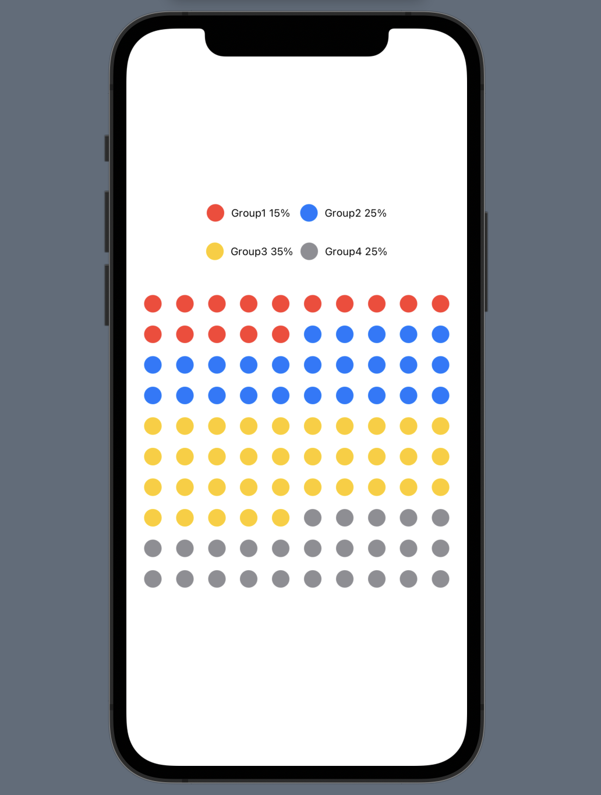
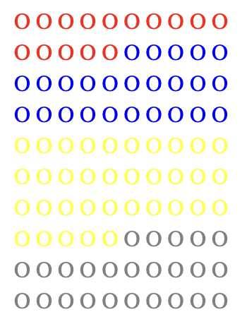

# GraphKit: A collection of graphs in SwiftUI

    

A collection of graph templates available in SwiftUI.

- [Why](#why)
- [Requirements](#requirements)
- [How To Use](#howToUse)
- [Contents](#contents)
- [Contributing](#contributing)
- [License](#license)
- [Support](#support)
- [Credits](#credits)

 

## Why

The goal is simple.
We want to use various graphs easily.

 

## Requirements

**iOS**

- iOS 14.0, macOS 11.0, Mac 14.0, tvOS 14.0
- Swift 5.3
- Xcode 12.4

<!-- **Web**
- 1
- 2 -->

 

## How To Use

- It is possible to modify and use each graph view independently without installing additional packages
- Usage is explained in comments on each GraphView.

 

## Contents

- **DotGraphView**: SwiftUI, React

 

## Contributing

GraphKit welcomes contributions in the form of GitHub issues and pull-requests.

 

## License

GraphKit is licensed under the [MIT License](https://vmanot.mit-license.org).

 

## Support

GraphKit is and will always be free and open. If you're reliant on GraphKit for your app/project and would like to see it grow, consider contributing/donating as way to help.

 

## Credits

GraphKit is a project of [@Taeeun_Kim](https://github.com/Taeeun-Kim) and [@maxRN](https://github.com/maxRN) and [@DainPark-web](https://github.com/DainPark-web)
