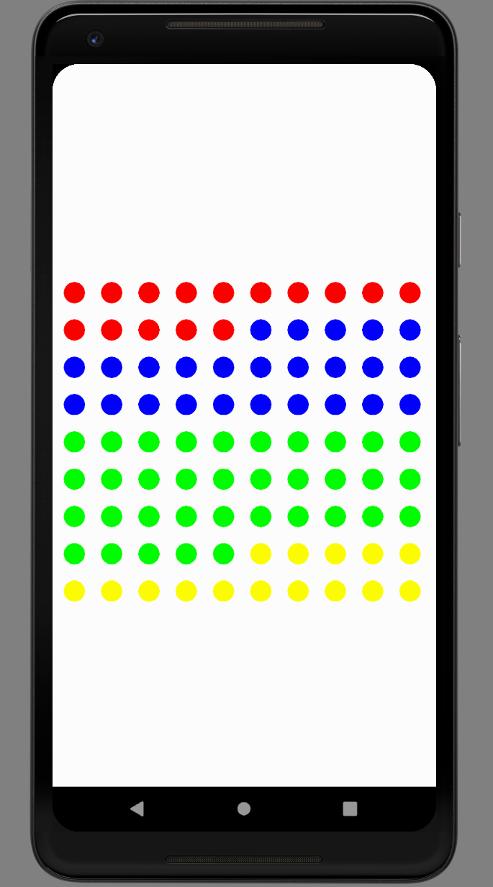

# DotGraphView: A customView in Android

A customView of Dotgraph templates available in Android.

- [How To Use](#HowToUse)
- [Contents](#contents)
- [Contributing](#contributing)
- [Support](#support)

<br/>

<br/>

## How To Use


```java
public DotGraph(Context context, @Nullable AttributeSet attrs) {
        super(context, attrs);

        DotRadius = 40;
        Interval = 60;
        graphRatio = new GraphRatio(15, 25, 35, 25);
    }
```
**Change and use the radius, interval, and ratio.**</br>
**The size of the view is automatically adjusted and you can choose 2, 3 or 4 colors.**</br>
**Add more if you need It is open source.**</br>
<br/>

## Contents

- **DotGraphView**: **Android**
<p>

</p>

<br/>

## Contributing

GraphKit welcomes contributions in the form of GitHub issues and pull-requests.

<br/>

## Support

DotGraphView is and will always be free and open. If you're reliant on GraphKit for your app/project and would like to see it grow, consider contributing/donating as way to help.

<br/>
